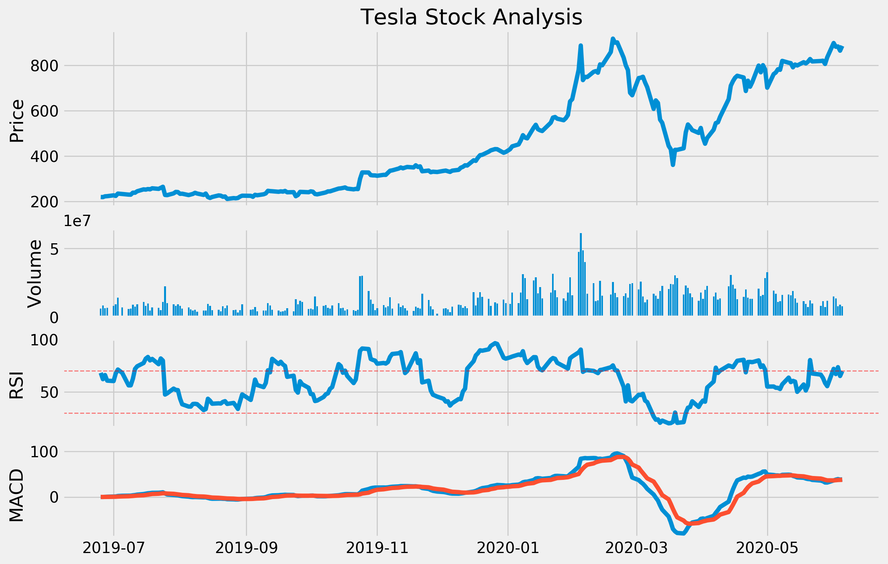

# Stocks-Analysis-Dashboard
WIP - Dashboard with stock price analysis (Volume, RSI, MACD)

The goal is to create an interactive Dashboard:
- User can choose the stock
- Daterange
- Indicators

I the end the user should be able to download the result as a pdf or image

### To Do
- make it interactive
- deploy it with steamlit
- use plotly to give more informations

### First Result

### libaries
- numpy
- pandas
- matplotlib
