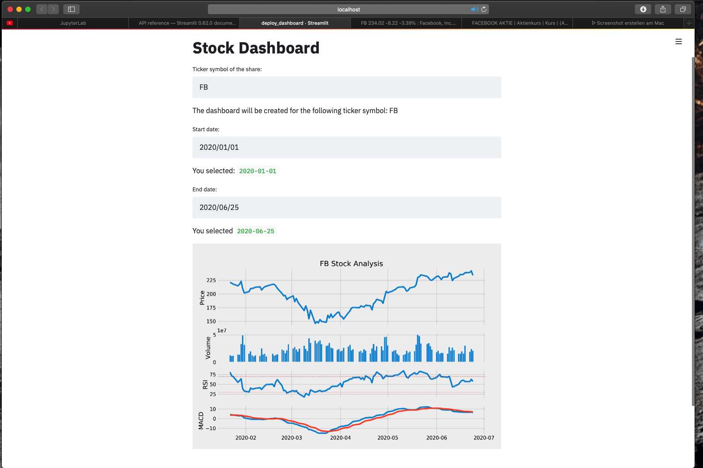

# Stocks-Analysis-Dashboard
WIP - Dashboard with stock price analysis (Volume, RSI, MACD)

The goal is to create an interactive Dashboard:
- User can choose the stock
- Date range 
- Indicators

### To Do
- use plotly to give more informations
- add more indicators
- make indicators interactive

### Files
- Stock_dashboard.ipynb: Jupyter notebook, to test the code 
- dashboard_streamlit.py: file to run the dashboard in the webbrowser

### How to run
1. Set working directory to folder
2. Activate virtual environment with the relevant libaries installed (I use Anaconda):
`$ conda activate base `
3. Run dashboard_streamlit.py:
`$ streamlit run dashboard_streamlit.py`
4. Dashboard opens in browser
5. Now you can choose the share with the ticker symbol and the date range.

### Example

### libaries
- numpy
- pandas
- matplotlib
- streamlit
