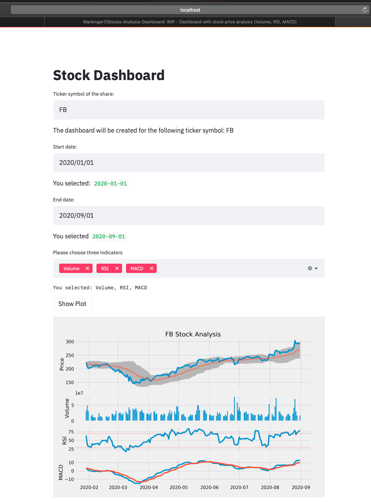

# Stocks-Analysis-Dashboard
Dashboard with stock price analysis

This is an interactive dashboard  where users can pick a stock ticker, the date range and indicators.
The following indicators are currently implemented:
- Volumne
- RSI
- MACD
- MFI
- Bollinger Band (currently static but will be interactive)

Some indicators that will be implemented:
- full cusomizabel SMA & EMA, with Bollinger Band
- Stochastic Oscillator
- CCI Momentum

### To Do
- use different visualization libary (Plotly, Bokhe)
- add notations when basic trading strategies are present
  - death cross, golden corss etc.
- add recent news from the company to the dashboard

### Files
- Stock_dashboard.ipynb: Jupyter notebook, to test the code 
- dashboard_streamlit.py: file to run the static dashboard in the webbrowser
- dashboard_st_interactive.py: file to run the dashboard with interactivity
- dashboard_demo.mp4: video showing the functions of the dashboard

### How to run
1. Set working directory to folder
2. Activate virtual environment with the relevant libaries installed (I use Anaconda):
`$ conda activate base `
3. Run dashboard_streamlit.py:
`$ streamlit run dashboard_st_interactive.py`
4. Dashboard opens in browser
5. Now you can choose the share with the ticker symbol and the date range.

### Interactive Vesion of the dashboard

### libaries
- numpy
- pandas
- matplotlib
- streamlit
- yfinance
